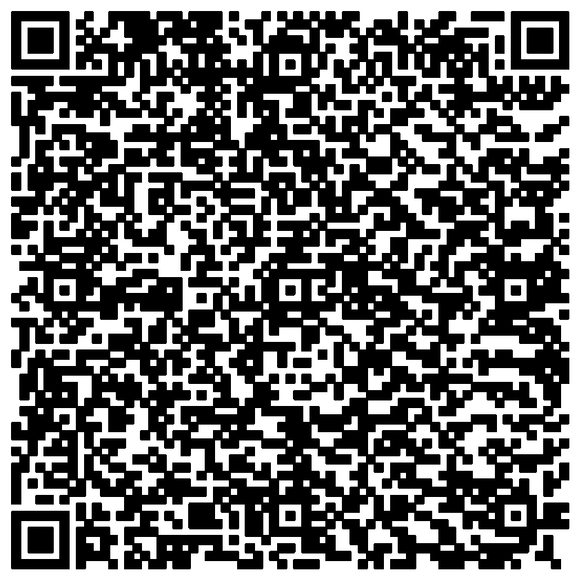
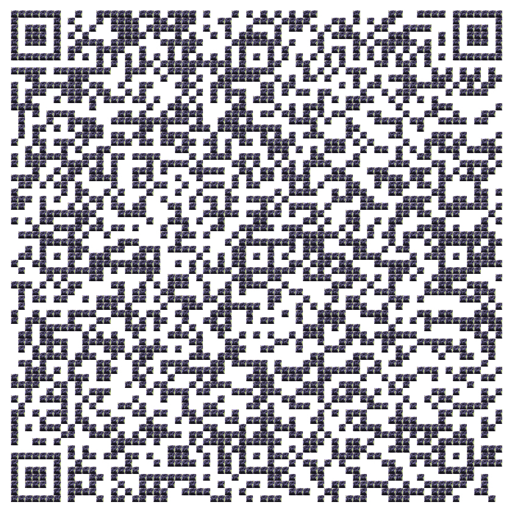
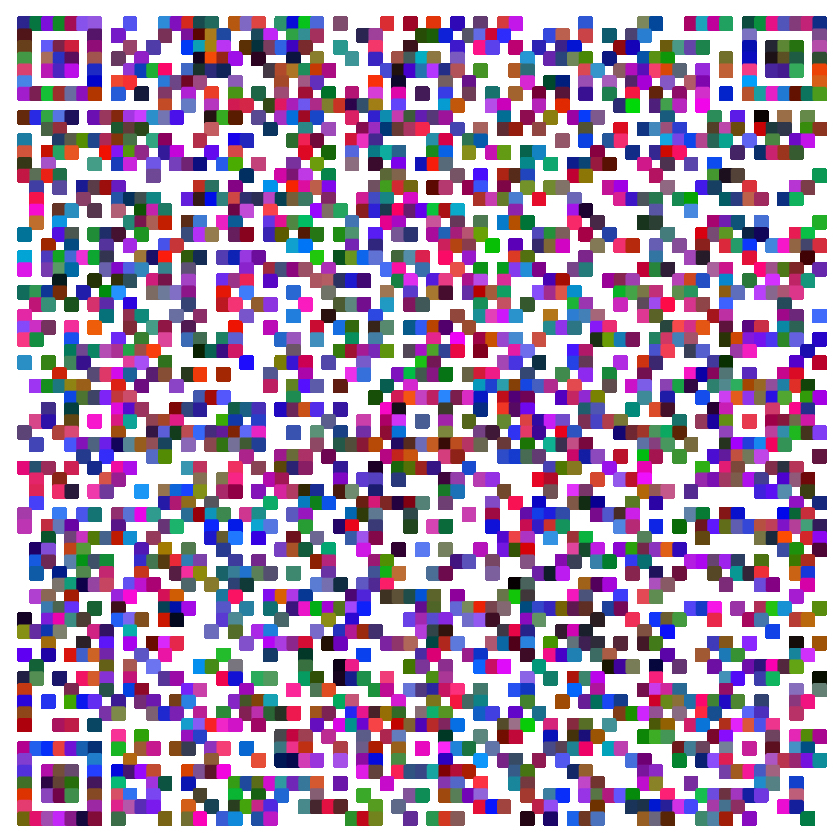
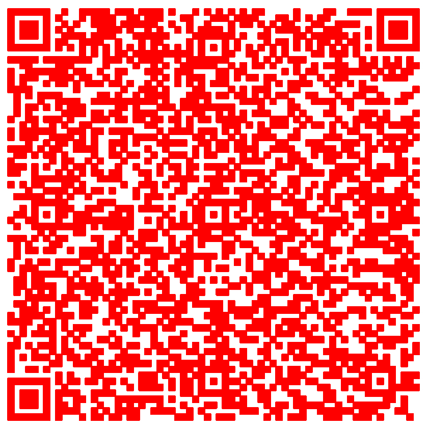

# COSC494 - Lab 1: Jgraph

## Name: The Happy Qr Code 

## Student
Name: `Ryan Stewart`  
Date: `9/25/21`

### Compile

```bash
foo@bar:~$ cd src 
foo@bar:~$ make
```

### Usage
```
usage ./happy_qr_code [qrcode.ppm] [output-file-name] [option] [arg] ...
options and arguments:
-c               : input an rgb value to use to change the QR code color to (i.e. "1 0 0")
-p [image-file]  : uses a jpeg or png picture for the squares of the qr code
-r               : will use random colors for the qr code
-h | --help      : list the usage and options
```

### Examples

**Normal**


**Picture as the squares**


**Random Colors**


**Chosen Color**

